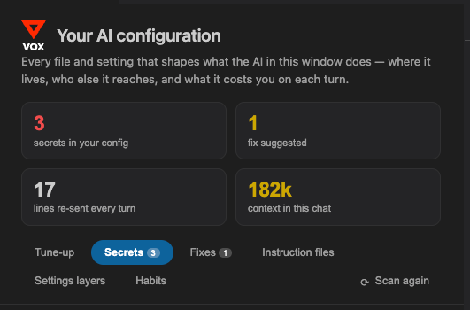
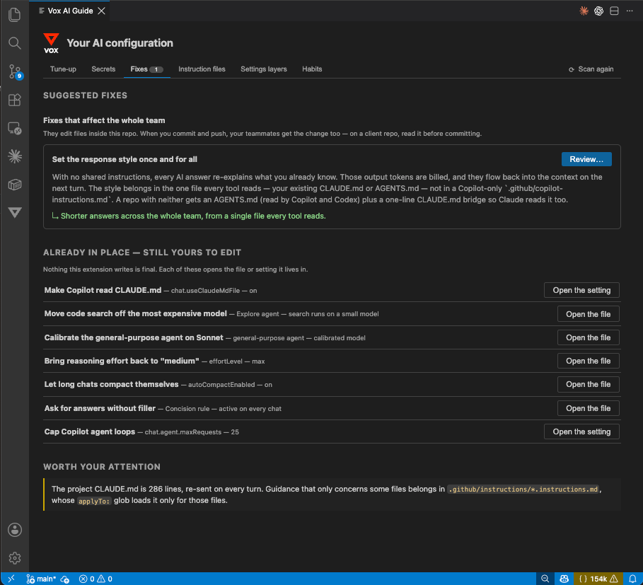
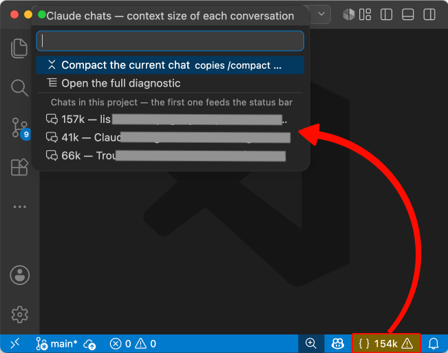

# Vox AI Guide for VSCode

Shows where your Copilot and Claude Code configuration lives, what it costs you in tokens on every turn, and which credentials it exposes. Runs locally, sends nothing anywhere, and never writes a file without showing you the diff first.

<p align="center">
  
</p>

## Why

Copilot reads five kinds of instruction file. Claude Code reads another set. They overlap in one place and contradict each other in three, and somewhere in there a settings file holds an API key.

Two questions, one sweep of the same files:

- **Is my AI setup costing more than it should?** An oversized `CLAUDE.md` is re-sent on every turn. Subagents inherit the session's model, so every code search runs on the most expensive one.
- **Are my keys safe?** The same `CLAUDE.md` with an API key in it sends that key to the provider on every turn. If the file is tracked by git, it is already gone.

Every fix explains *why* before it offers a button, so you learn the mechanism instead of depending on the tool.

## What you get

### A diagnostic panel

`Vox AI: Diagnose my AI configuration` opens the full map in an editor tab. Six sections: secrets, current Claude session, suggested fixes, every instruction file (present or not, loaded or not), active VSCode settings with the layer they come from, and habits.

<p align="center">
  
</p>

### A sidebar

An icon in the activity bar shows four figures — secrets found, fixes available, lines re-sent every turn, context size of the current chat. Each one is a button into the tab that explains it. The badge counts exposed credentials.

### A status bar counter

The context size of the conversation in front of you, in thousands of tokens. Past your threshold it warns: from there, every turn resends a history you pay for twice. Click it to list every recent chat with its own counter, or copy a ready-to-paste `/compact`.

<p align="center">
  
</p>

## Commands

| Command | What it does |
|---|---|
| `Vox AI: Diagnose my AI configuration` | Opens the full diagnostic panel |
| `Vox AI: How is my Claude session doing?` | Context size, model and subagents of the current chat |
| `Vox AI: List my Claude conversations (and compact one)` | Every recent chat with its counter; copies `/compact` for the one you pick |
| `Vox AI: Scan my Claude transcripts for secrets` | Sweeps `~/.claude/projects/**/*.jsonl` for credentials |
| `Vox AI: Clean up old conversation archives` | Lists chat logs by project and size, deletes to the Trash |

## What it checks

### Secrets, and how they escape

A conventional scanner tells you a key is present. This one tells you **how far it went**, because the fix depends on it:

| Vector | Reach | Fix |
|---|---|---|
| **Git** — the file is tracked and was pushed | The whole repository, permanently | Revoke the key. A `.gitignore` added afterwards repairs nothing |
| **Context** — the file is loaded into the prompt | The provider, plus your local transcripts | Remove the secret, then revoke |

The usual traps: the `env` block of `settings.json`, `claudeCode.environmentVariables` in `.vscode/settings.json` (version-controlled by default), the `env` block of an MCP server in `.mcp.json`. And the one nobody thinks about: Claude Code transcripts record everything that hit the screen — a `cat .env`, a `printenv`, an API response. `/clear` erases nothing on disk.

**The value of a secret is never displayed.** Not in the panel, not in a notification, not in a log. The `Finding` type does not carry it, so it cannot leak through a screenshot, a screen share, or an agent asked to read the panel.

### Cost

Both tools bill per token. The extension walks your local transcripts and splits the spend three ways:

| Bucket | What it is | What to do |
|---|---|---|
| **Helper agents** | Everything the subagents burned | Pin them to a cheaper model — they inherit the session's by default |
| **Long chats** | Turns whose context had already passed 150k | `/clear` between tasks |
| **Normal work** | The rest | Nothing — this is what you meant to spend |

On the machine this project came from, 86% of the spend sat in the first bucket: 78 code searches on Opus.

### Instruction files

Every location we know of, in four tables, and for each file: who reads it, how far it reaches, whether it exists, and whether it is **actually loaded** — several depend on a VSCode setting people forget to switch on.

- **Claude Code** — numbered in the order they stack.
- **Copilot** — unnumbered; it merges its files with no documented precedence.
- **On demand** — `.claude/skills`, `.claude/agents`, `.claude/commands`, `.github/prompts`, `.github/chatmodes`. Only the name and a one-line description sit in the permanent context; the body loads when used. This is the way out of a bloated `CLAUDE.md`.
- **The rest of the ecosystem** — Cursor, Windsurf, Cline, Roo, Continue, Gemini, Zed, Aider, Junie. A stale `.cursorrules` can quietly win over `AGENTS.md`, because some editors take the first file they find.

A tool you do not have still gets a row. You cannot learn the shape of a system from a list of the parts you already installed.

## The fixes

Each one carries its *why* and shows a before/after preview before touching anything. Writes to `~/.claude/settings.json` create a `.bak` first.

| Fix | Effect |
|---|---|
| Make Copilot read `CLAUDE.md` | `chat.useClaudeMdFile` — one file for both tools |
| Bridge `AGENTS.md` to Claude Code | A one-line `CLAUDE.md` importing your existing `AGENTS.md` (Claude never reads it on its own) |
| Move code search off the most expensive model | The `Explore` agent runs on a small model instead of inheriting Opus |
| Calibrate the general-purpose agent on Sonnet | Same mechanism, for the general-purpose agent |
| Bring reasoning effort back to "medium" | Stop paying for long reasoning on trivial turns |
| Let long chats compact themselves | `autoCompactEnabled` |
| Ask for answers without filler | A concision rule that kills preambles and closing summaries, without touching code output |
| Cap Copilot agent loops | `chat.agent.maxRequests` to 25 |
| Set the response style once and for all | In the one file every tool reads, not in a Copilot-only `.github/copilot-instructions.md` |
| Close the tabs polluting your context | Copilot builds its context from your open editors |

On a detected secret there are only two actions: **Open** the file at the right line, or **Ignore** it in `.gitignore`. No automatic rewriting of a file that holds a credential. When the file is already tracked, the fix points at revocation instead.

## Privacy

- **Zero network egress.** Local reads, displayed to you, on your machine. On a secret detector, the slightest callback would be credential exfiltration.
- **Nothing collected, nothing to declare.** Transcripts contain client code; centralising them, even internally, touches NDAs and worker-consultation law. If management wants figures, they exist at organisation level in the Anthropic Admin API and the GitHub billing report.
- **Deleting is the one irreversible act**, so it goes to the Trash, only touches chat logs inside known archive folders, spares the live conversation, and names the exact count and size before it runs.

## Settings

| Setting | Default | What it does |
|---|---|---|
| `voxAiGuide.statusBar.enabled` | `true` | Show the current Claude session's context size in the status bar |
| `voxAiGuide.statusBar.warnAtTokens` | `150000` | Threshold past which the status bar warns |
| `voxAiGuide.library.path` | `""` | Folder holding your team's best-practice entries (Markdown with a `slot:` header). Falls back to `~/.claude/vox-library`. Read locally, never fetched |

## Install

Search **Vox AI Guide** in the Extensions view, or:

```bash
code --install-extension plog.vox-ai-guide
```

## Develop

```bash
npm install
npm run compile          # or: npm run watch
npm test
```

**F5** launches a test window. `npx @vscode/vsce package` builds the `.vsix`.

To add a fix, edit `src/fixes.ts` only. A fix is `{ id, title, why, gain, applicable(), preview(), apply() }`; `preview()` is mandatory.

| File | Role |
|---|---|
| `src/scan.ts` | Instruction locations, settings layers, warnings |
| `src/secrets.ts` | Credential detection — never carries a value |
| `src/fixes.ts` | Fixes and tips |
| `src/usage.ts` | Transcript reading: current session, spend split |
| `src/panel.ts` | The diagnostic panel |
| `src/sidebar.ts` | The activity-bar view and badge |
| `src/cleanup.ts` | Archive grouping and deletion to the Trash |
| `src/claudeTabs.ts` | Which chat is on screen, from Claude Code's tab order |
| `src/paths.ts` | Cross-platform paths, JSON I/O with `.bak` |

## Scope

VSCode only. Developers running `claude` in a terminal outside VSCode are not covered.

## License

MIT. Questions, false positives, fixes to add: [open an issue](https://github.com/plog/vox-ai-guide/issues).
